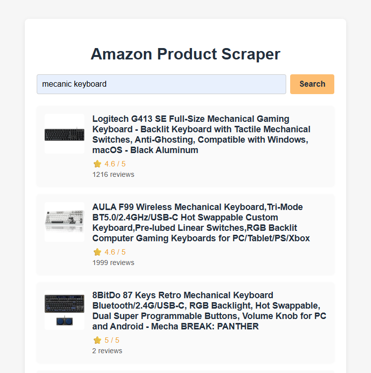

# Amazon Product Search + Scraping

<p align="center">
  
</p>


# Project Structure

- `src/backend/` — Backend code (Express, scraping)
- `src/frontend/` — Frontend (HTML, CSS, JS, Vite)

## How to Run the Project

### Prerequisites
- [Bun](https://bun.sh/) installed

### 1. Install dependencies
In the project root directory, run:
```sh
bun install
```

### 2. Run the backend
In one terminal, execute:
```sh
cd src/backend
bun run index
```
or
```sh
bun src/backend/index
```
The backend will be available at http://localhost:3000

### 3. Run the frontend
In another terminal, at the project root, execute:
```sh
bunx vite
```
The frontend will be available at http://localhost:5173

### 4. Access the application
Open http://localhost:5173 in your browser, enter a search keyword, and see the results.

The frontend automatically proxies API requests to the backend at `/api`.

### 5. Warning about Amazon
Amazon may block scraping requests. To work around this, you may need to use proxies or request access to the Amazon API.
