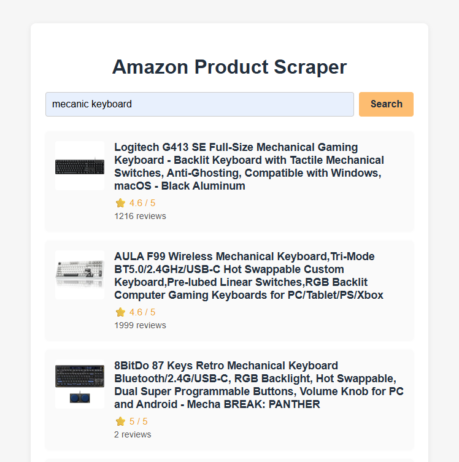

# Amazon Product Search + Scraping

<p align="center">
  
</p>


# Estrutura do Projeto

- `src/backend/` — Código do backend (Express, scraping)
- `src/frontend/` — Frontend (HTML, CSS, JS, Vite)


## Como rodar o projeto

### Pré-requisitos
- [Bun](https://bun.sh/) instalado

### 1. Instale as dependências
No diretório raiz do projeto, rode:
```sh
bun install
```

### 2. Rode o backend
Em um terminal, execute:
```sh
cd src/backend
bun run index
```
ou
```sh
bun src/backend/index
```
O backend estará disponível em http://localhost:3000

### 3. Rode o frontend
Em outro terminal, na raiz do projeto, execute:
```sh
bunx vite
```
O frontend estará disponível em http://localhost:5173

### 4. Acesse a aplicação
Abra http://localhost:5173 no navegador, faça uma busca e veja os resultados.

O frontend faz proxy para o backend em `/api` automaticamente.

### 5. Aviso sobre a Amazon
A Amazon pode bloquear requisições de scraping. Para contornar isso, você pode precisar usar proxies ou solicitar acesso à API da Amazon.
